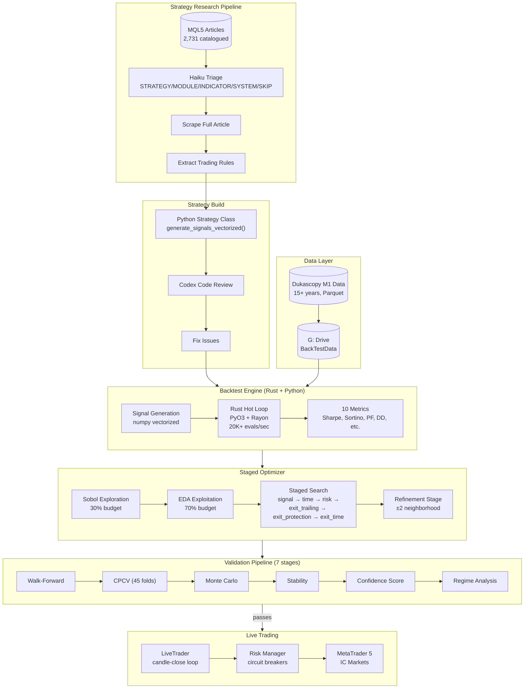

# System Architecture

## Overview

Fully automated forex trading system that discovers, validates, deploys, and monitors trading strategies. Built in Python + Rust.

## Component Details

### Data Layer
- **Source**: Dukascopy (free M1/tick data, 15+ years)
- **Storage**: Parquet files on Google Drive (`G:\My Drive\BackTestData`)
- **Pairs**: EURUSD, GBPUSD, USDJPY, XAUUSD (expanding)
- **Parity**: Dukascopy vs IC Markets verified <0.3 pip median diff

### Strategy Framework (`backtester/strategies/`)
- **Base class**: `Strategy` ABC — `generate_signals_vectorized()`, `param_space()`, `management_modules()`
- **10 strategies registered** (9 original + Hidden Smash Day from research pipeline)
- **Signal pattern**: precompute-once (expensive), filter-many (cheap per trial)
- **Signal encoding**: variant/filter_value for legacy, `PL_SIGNAL_P0-P9` for expanded (10 generic slots)

### Management Modules (`backtester/strategies/modules.py`)
Reusable exit/management components. Each module declares params, PL slot mapping, optimization group.

| Module | Group | What it does |
|--------|-------|-------------|
| TrailingStopModule | exit_trailing | Fixed pip or ATR chandelier trailing stop |
| BreakevenModule | exit_protection | Move SL to entry after trigger distance |
| PartialCloseModule | exit_protection | Close % of position at trigger distance |
| MaxBarsModule | exit_time | Close trade after N bars |
| StaleExitModule | exit_time | Close if price movement below ATR threshold |

### Rust Hot Loop (`rust/src/`)
- **PyO3 + Rayon** native extension — sole backend
- **NUM_PL = 64** parameter slots (was 27), index-based indirection
- **Throughput**: 18K-35K evals/sec BASIC, 4K-10K evals/sec FULL
- **Panic safety**: `catch_unwind` per trial, zeros metrics on panic
- **Key files**: `lib.rs` (batch_evaluate), `constants.rs` (PL_* slots), `trade_full.rs` (management logic)

### Staged Optimizer (`backtester/optimizer/`)
- **Sobol** exploration (30%) → **EDA** exploitation (70%) per stage
- **Stages auto-generated** from strategy's `management_modules()` groups
- **Default order**: signal → time → risk → exit_trailing → exit_protection → exit_time → refinement
- **Refinement**: all params active, ±2 index neighborhood around locked best

### Validation Pipeline (`backtester/pipeline/`)
7 stages, each with hard gates:
1. Walk-forward (rolling/anchored + embargo)
2. CPCV (45 folds, combinatorial purged)
3. Monte Carlo (block bootstrap, sign-flip, trade-skip)
4. Stability (±3 step perturbation, advisory)
5. Confidence (DSR gate + 6-component composite 0-100)
6. Regime analysis (ADX+NATR 4-quadrant, per-regime stats)

### Live Trading (`backtester/live/`)
- **Broker**: IC Markets Global (MT5, Seychelles FSA, 1:500 leverage)
- **Engine**: `trader.py` — candle-close event loop
- **Position management**: mirrors backtest (trailing, BE, partial, stale, max bars)
- **Risk**: pre-trade checks, position sizing, circuit breaker
- **Deploy**: `DEPLOY.bat` → VPS

### Strategy Research Pipeline (`scripts/`, `Research/`)
- **Catalogue**: 2,731 MQL5 articles in `Research/mql5_catalogue.json`
- **Triage**: Haiku classifies as STRATEGY/MODULE/INDICATOR/SYSTEM/SKIP
- **200 classified so far**: 62 strategies, 11 modules, 24 indicators, 31 system
- **Per-article flow**: scrape → extract rules → build strategy → Codex review → optimizer + pipeline

## Key Files Quick Reference

| File | Purpose |
|------|---------|
| `CLAUDE.md` | Claude Code instructions (rules, conventions) |
| `CURRENT_TASK.md` | Session pickup — exact next steps |
| `docs/architecture.md` | This file — full system overview |
| `docs/tooling-setup.md` | Plugin install instructions |
| `backtester/strategies/modules.py` | All management modules (single file for review) |
| `backtester/strategies/base.py` | Strategy ABC, ParamDef, param groups |
| `backtester/core/engine.py` | BacktestEngine, signal unpacking, batch_evaluate bridge |
| `rust/src/constants.rs` | PL_* slot definitions (NUM_PL=64) |
| `rust/src/lib.rs` | Rust batch_evaluate entry point |
| `backtester/optimizer/staged.py` | StagedOptimizer orchestrator |
| `backtester/pipeline/runner.py` | PipelineRunner (stages 3-7) |
| `backtester/live/trader.py` | LiveTrader event loop |
| `scripts/full_run.py` | E2E optimization + pipeline CLI |
| `scripts/crawl_mql5_articles.py` | MQL5 article crawler |
| `scripts/triage_articles.py` | Haiku article classifier |
| `Research/mql5_catalogue.json` | Master article catalogue |
